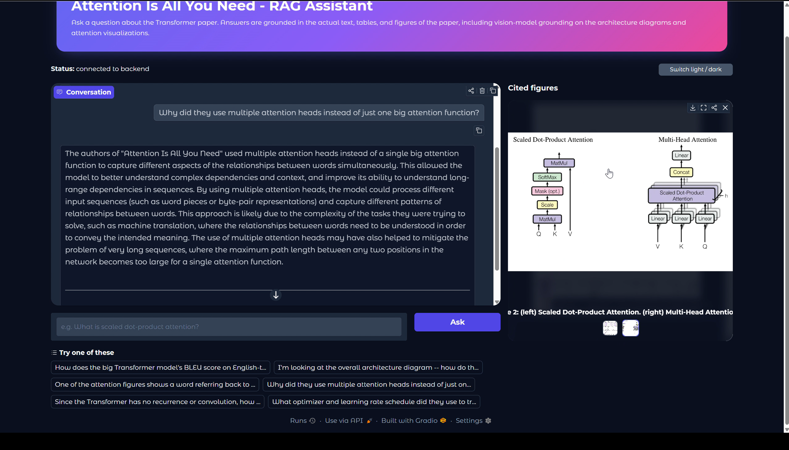
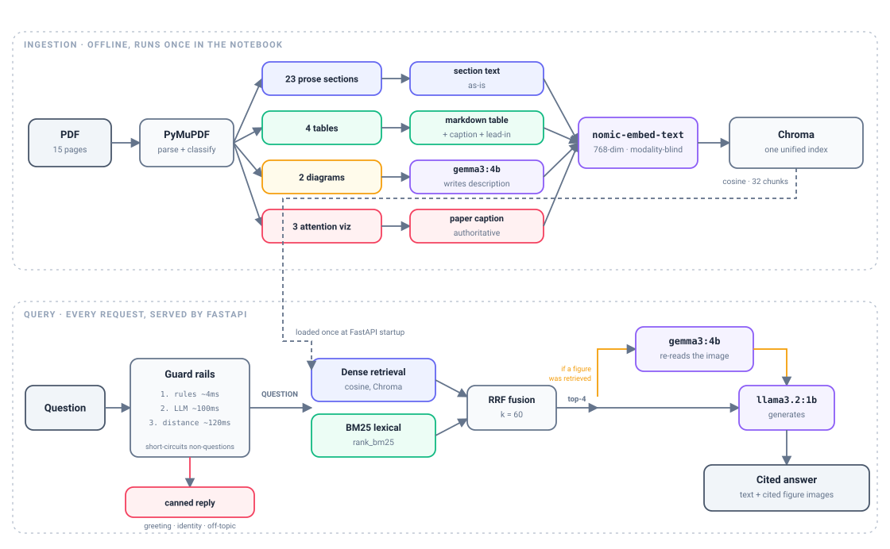
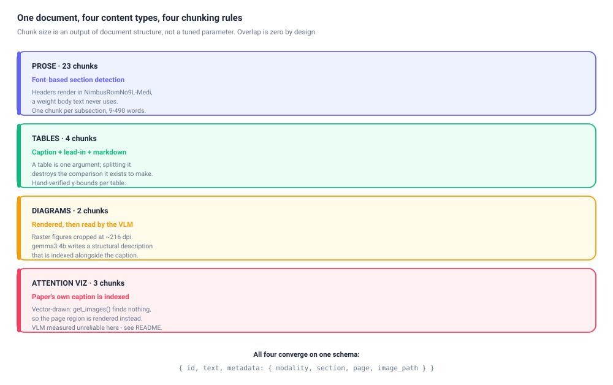
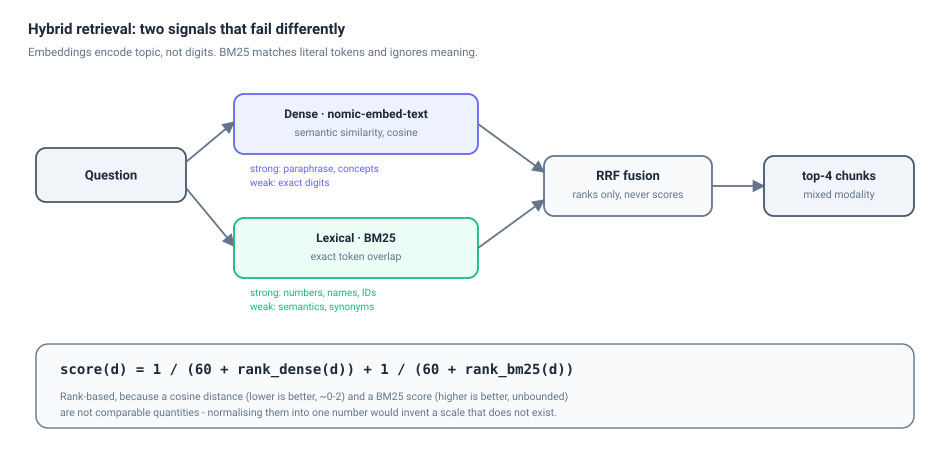
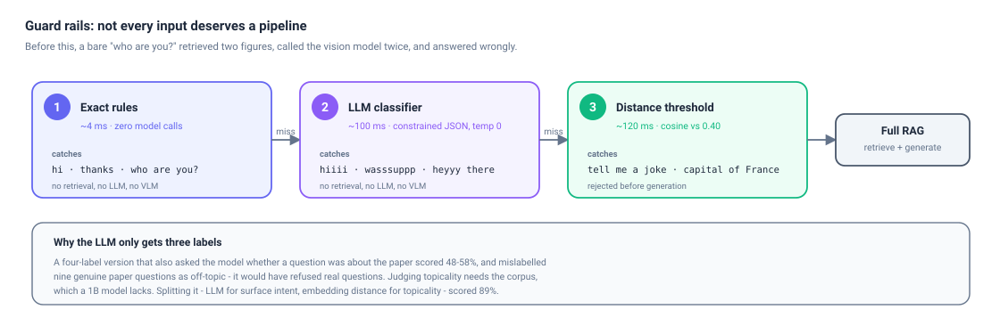

# Multimodal RAG Assistant — *Attention Is All You Need*

A retrieval-augmented generation system over a single, deliberately chosen document: the
original Transformer paper (Vaswani et al., 2017). It answers questions from the paper's
**prose, data tables, architecture diagrams and attention visualisations**, cites the exact
section or table each answer came from, and renders the figures it cited.

Everything runs locally through [Ollama](https://ollama.com). No cloud API is called at any
point, and no API key exists anywhere in this repository.

```
Question ──▶ guard rails ──▶ hybrid retrieval ──▶ vision grounding ──▶ generation ──▶ cited answer
```



*Answering a question about multi-head attention. The panel on the right is not decoration:
Figure 2 was retrieved as one of the top-4 chunks, so the vision model re-read the actual image
before the answer was generated, and the figure it cited is rendered alongside. Text-only answers
return no images and the panel stays hidden.*

---

## Table of contents

- [Why this document](#why-this-document)
- [Architecture](#architecture)
- [Chunking strategy](#chunking-strategy)
- [The vision-language model, used twice and differently](#the-vision-language-model-used-twice-and-differently)
- [One unified vector store](#one-unified-vector-store)
- [Hybrid retrieval](#hybrid-retrieval)
- [Guard rails](#guard-rails)
- [Models, and why each one](#models-and-why-each-one)
- [Backend](#backend-fastapi)
- [Frontend](#frontend-gradio)
- [Setup](#setup)
- [Running](#running)
- [API reference](#api-reference)
- [Environment variables](#environment-variables)
- [Evaluation results](#evaluation-results)
- [Known limitations](#known-limitations)
- [Project structure](#project-structure)

---

## Why this document

The brief allowed any domain. A single paper was chosen over a large corpus on purpose,
because this particular paper **densely mixes every content type a multimodal RAG system has
to handle**:

| Content type | Instances | Retrieval problem it creates |
|---|---|---|
| Prose with inline maths | 23 subsections | Section boundaries carry meaning; naive splitting severs arguments |
| Data tables | 4 | Numbers embed poorly; splitting a table destroys the comparison |
| Architecture diagrams | 2 (raster) | No text layer at all — unreachable without vision |
| Attention visualisations | 3 (vector-drawn) | `get_images()` finds nothing; must be rendered from the page |

A larger corpus of uniform prose would have been easier and would have demonstrated less.

The multimodal requirement is instead met by a **vision-language model** that reads and grounds
the diagrams. This is a substitution of technique, not a reduction in scope: the vision model is
load-bearing, invoked both at ingestion and at query time, and the system cannot answer figure
questions without it.

---

## Architecture



Two phases, one shared index:

**Ingestion** runs once, offline, in the notebook. The PDF is parsed, classified into four
content types, processed per type, embedded by a single text model, and persisted to Chroma.

**Query** runs per request inside FastAPI. The vector store is loaded once at startup — never
rebuilt per request. A question passes the guard rails, retrieves through two independent
ranking signals, optionally triggers vision grounding if a figure was retrieved, and is answered
with citations.

The principle that holds it together:

> **The embedding model is modality-blind.** It only ever sees strings. A table is embedded as
> its markdown; a figure as its caption plus description. `modality` and `image_path` exist for
> downstream routing — when to call the vision model, what to render, how to cite — and never
> as inputs to the embedding step.

---

## Chunking strategy



### Why not fixed-size chunks with overlap

The conventional default — roughly 500 tokens with 50 tokens of overlap — is a concession to
*not knowing where the semantic boundaries are*. In this document we do know, so a
structure-aware strategy strictly dominates it:

| Strategy | Failure on this document |
|---|---|
| Fixed-size + overlap | Splits Table 2 mid-row, so half a table retrieves as noise. Cuts section 3.2.1 in two, so "why divide by √d_k" is separated from its own explanation |
| **Section-based (chosen)** | Every chunk is a complete, self-contained unit with a natural citation label |

Two consequences follow, and both are design decisions rather than oversights:

**Chunk size is an output, not a parameter.** Sections run 9–490 words (mean 176), comfortably
inside `nomic-embed-text`'s 2048-token window. Nothing needed tuning because the document's own
structure set the boundaries.

**Overlap is zero.** Overlap exists to stop a fixed-size window severing an idea mid-sentence.
With section boundaries, nothing is severed, so overlap would only duplicate text, inflate the
index, and allow one section's content to be cited under a neighbouring section's ID.

### Section detection, and two real bugs

The paper's LaTeX style renders headers in a distinct medium-weight font (`NimbusRomNo9L-Medi`)
that body text never uses. A standalone medium-weight line matching `^[1-9](\.[1-9]){0,2}$` is a
section number; the next such line is its title.

Two bugs surfaced during development, both preserved in the code because they generalise:

1. **Bold table values masqueraded as section headers.** The bold BLEU/PPL figures in Tables 2–3
   (`41.29`, `4.33`) use the *same* medium-weight font as real headings and matched a looser
   number regex, opening bogus sections mid-table. Fixed by requiring every dot-separated
   component to be a single digit — real headings here never exceed `6.3`.
2. **Table regions swallowed the discussion that followed them.** A caption-based "skip until the
   next header" rule over-skipped, because Tables 3 and 4 are each followed by discussion prose
   with no header in between. Fixed with hand-verified y-coordinate bounds per table,
   cross-checked against `page.find_tables()` where it agreed.

### Tables

Each table becomes **one chunk**, because a table is a single argument and splitting it destroys
the comparison it exists to make. Each carries three things: the caption (what it is), a lead-in
sentence located by regexing the prose for "Table N" mentions (why it matters), and the table as
markdown (a grid an LLM can read).

`page.find_tables()` only auto-detected Tables 3 and 4, and mangled Table 3's merged `(A)`–`(E)`
row-groups; Tables 1 and 2 it missed entirely. The cells were therefore transcribed once from the
raw span dump and hard-coded — appropriate for a **bespoke single-document pipeline**, not a
general-purpose parser.

---

## The vision-language model, used twice and differently

`gemma3:4b` is applied in two roles, and the asymmetry between them is the most interesting
finding in the project.

| | Figures 1–2 (diagrams) | Figures 3–5 (attention viz) |
|---|---|---|
| **At ingestion** | VLM writes a structural description, which is indexed | Paper's own caption is indexed; **VLM not used** |
| **At query time** | VLM re-reads the image, question-aware | VLM re-reads it, **anchored to the caption** |

### Why the asymmetry — measured, not assumed

The attention-visualisation figures were tested directly, and the results decided the design.

**Reading rotated text: excellent.** Those figures render token labels rotated 90°. `gemma3:4b`
transcribed them essentially perfectly in *both* the original orientation and a manually
un-rotated copy — so no pre-rotation step was needed, and the obvious "fix" would have been
wasted work.

**Reasoning about attention strength: unreliable.** Asked which word Figure 3 highlights, it
confidently answered **"difficult"**. The correct answer is **"making"**.

So for these three figures the paper's own caption — written by the authors, verified accurate —
is the better retrievable text, and the VLM's query-time job is narrowed to describing what is
visible *anchored to that caption*, rather than inferring attention weights from pixels.

### An honest caveat on the stored descriptions

The diagram descriptions are **noisy and non-deterministic**. Two runs over Figure 1 produced
different, each partially-wrong descriptions: one merged the encoder and decoder stacks, the other
dropped the decoder entirely.

They are therefore treated as a **retrieval aid** — text that helps the right figure surface for a
query — and never as ground truth. The image itself remains authoritative, which is precisely why
`image_path` is carried all the way through to the API response and rendered in the UI. The user
sees the real figure, not only a 4B model's paraphrase of it.

---

## One unified vector store

A tempting design is one store per modality with a router in front. This pipeline uses a
**single unified index** instead, because the router would have to guess the answer's modality
*before* retrieving — and users don't phrase questions that way.

> *"How much does a single attention head cost in BLEU?"*

That is answered by a **table**, but nothing in the wording says so. A modality router would
have to infer it; a unified index simply retrieves the right chunk.

Every chunk, whatever its origin, lands in one schema:

```json
{
  "id": "Table 2",
  "text": "Table 2: The Transformer achieves better BLEU scores...\n\n| Model | BLEU EN-DE | ...",
  "metadata": {
    "modality": "table",
    "section": "Table 2",
    "page": 8,
    "image_path": null
  }
}
```

| Property | Value |
|---|---|
| Chunks | 32 (23 text · 4 table · 2 diagram · 3 attention-viz) |
| Embedding model | `nomic-embed-text`, 768 dimensions |
| Store | Chroma, persistent, cosine space |
| Collection | `attention_paper` |

### The asymmetric-prefix detail

`nomic-embed-text` is trained with **task prefixes**: corpus text must be embedded as
`search_document: ...` and queries as `search_query: ...`.

Omitting them — or worse, using the same prefix on both sides — measurably degrades retrieval
*while appearing to work fine*, which makes it the kind of bug that ships. Both sides are defined
together in the pipeline so they cannot drift apart, and the values are written into
`pipeline_config.json` so the backend inherits exactly what the notebook used.

---

## Hybrid retrieval



Dense retrieval alone is the obvious choice and it mostly works. It has one weakness that
matters acutely here: **embeddings encode topic, not digits.** A query naming a specific BLEU or
parameter value embeds almost identically to one naming a different value — and this paper
contains several structurally similar numeric tables.

BM25 is the exact complement: it matches literal tokens and ignores semantics entirely. Over a
32-chunk corpus it is free to compute.

The two are combined with **Reciprocal Rank Fusion**:

```
score(d) = 1 / (60 + rank_dense(d)) + 1 / (60 + rank_bm25(d))
```

RRF uses only **ranks**, never raw scores. This matters: a cosine *distance* (lower is better,
roughly 0–2) and a BM25 *score* (higher is better, unbounded) are not comparable quantities, and
any attempt to normalise them into a single number invents a scale that does not exist.

---

## Guard rails



An early version ran the full pipeline on *every* input. A bare **"who are you?"** retrieved two
figure chunks, invoked the vision model **twice**, and answered *"the model is a Transformer
model."* Slow, expensive, and wrong.

Three layers now sit in front, each doing the job it measurably does best:

| Layer | Mechanism | Latency | Catches |
|---|---|---|---|
| 1 | Exact rules | **~4 ms** | `hi`, `thanks`, `who are you?` |
| 2 | LLM classifier, constrained JSON | **~100 ms** | `hiiii`, `wasssuppp`, `heyyy there` |
| 3 | Embedding distance threshold | **~120 ms** | `tell me a joke`, `capital of France` |

### Why the classifier gets only three labels

A four-label version that *also* asked the model whether a question was about the paper scored
**48–58%**, and mislabelled **nine genuine paper questions as off-topic** — it would have refused
to answer real questions, the worst possible failure mode.

The reason is structural: judging *"is this about the paper?"* requires knowing what is in the
corpus, which a 1B model does not. Splitting the job — **LLM for surface intent, embedding
distance for topicality** — scored **89%**, with 12/12 greetings and 18/18 real questions correct.

A related trap: the first classifier prompt was full of Transformer vocabulary, which biased the
model into labelling *everything* a paper question. The production prompt is deliberately free of
topic keywords.

### The threshold is measured, not guessed

| | Best cosine distance |
|---|---|
| On-topic questions (16 evaluated) | 0.14 – 0.35 |
| Off-topic questions (12 probes) | 0.36 – 0.52 |

The raw gap is only 0.01 — too tight to rely on. But greetings and thanks occupy the *bottom* of
the off-topic range, and layers 1–2 remove them first. With those handled, the remaining off-topic
minimum rises to **0.46**, leaving a comfortable margin around the **0.40** threshold.

The classifier **fails safe**: any Ollama or parsing error returns `QUESTION`, so a classifier
outage can never block a real question from being answered.

---

## Models, and why each one

Hardware constraint: an RTX 3060 laptop GPU with **6 GB VRAM**. Every choice below is downstream
of that number.

| Role | Model | Size | Why this one |
|---|---|---|---|
| Embedding | `nomic-embed-text` | 274 MB | 768-dim, outperforms `ada-002` on short and long passages, and small enough to stay resident permanently |
| Vision-language | `gemma3:4b` | 3.3 GB | Best quality-per-VRAM on 6 GB. Genuinely multimodal, and stronger at *structural* reasoning (box-and-arrow relationships) than OCR-specialised alternatives — which matters because this document is English and born-digital, not a scan |
| Generation | `llama3.2:1b` | 1.3 GB | See the note below |

### Rejected alternatives

**MiniCPM-V 8B** and **Qwen2.5-VL 7B** (~6 GB each) were rejected: each would consume the entire
card alone, and their strengths — dense-document OCR, multilingual OCR — do not match a
born-digital English paper. **Moondream 2** (~2 GB) was rejected as too weak for the structural
relationships in Figures 1–2.

### On `llama3.2:1b`

The original plan was `llama3.1:8b`. It was changed to `llama3.2:1b` for a practical reason worth
stating plainly: 8b was never pulled locally, and the smaller model was chosen over downloading
4.7 GB.

This is a **real quality trade-off, not a free win**, and it is visible in the evaluation — the 1B
model misreads table values under pressure (see [Known limitations](#known-limitations)).

It did produce one genuine benefit, though. Measured during the 16-question evaluation:

> `llama3.2:1b`'s `load_duration` stayed at **0.01–0.04 s across every single query**, while
> `gemma3:4b` was invoked 13 times in the same run. All three models
> (0.3 + 3.3 + 1.5 ≈ **4.7 GB**) stay co-resident in 6 GB VRAM, so **no model swapping occurs at
> all**. With a 7–8B generator they could not have coexisted, and figure questions would have paid
> a reload penalty on every request.

---

## Backend (FastAPI)

Structured to the assignment's prescribed skeleton.

```
backend/
├── app/
│   ├── main.py                  FastAPI app, CORS, lifespan startup, static mount
│   ├── api/routes/query.py      GET /health, POST /query
│   ├── core/config.py           pydantic-settings, absolute .env resolution
│   ├── schemas/query.py         QueryRequest / QueryResponse
│   ├── services/
│   │   ├── retrieval.py         vector store + BM25 index, hybrid retrieve
│   │   ├── generation.py        VLM grounding, prompt building, LLM call
│   │   └── intent.py            three-layer guard rails
│   └── utils/logging_config.py
├── data/                        vector store, chunks and images, exported by the notebook
├── tests/test_query.py          18 tests
├── requirements.txt             pinned
├── .env.example
└── Dockerfile
```

Three design points worth calling out:

**The store is loaded once, at startup.** `RetrievalService` is constructed in the FastAPI
`lifespan` handler and held on `app.state` — the Chroma collection, the 32 chunks and the BM25
index are built once per process, never per request.

**Image paths are re-rooted on load.** The exported chunk JSON carries paths relative to the
notebook's layout. `RetrievalService.__init__` re-roots each one against the backend's configured
`images_dir`, so the backend stays self-contained no matter where its data was generated.

**Everything resolves absolutely.** `config.py` resolves `.env` against the backend root rather
than the working directory, so the server behaves identically whether launched from the
repository root or from `backend/`.

### Tests

```
18 passed
```

Covering the happy path, `422` on invalid input, greetings, identity questions, off-topic
refusal, misspelled greeting variants routed through the LLM classifier, and a regression test
ensuring `"hi, what is multi-head attention?"` still reaches retrieval rather than being
swallowed as a greeting.

---

## Frontend (Gradio)

```
frontend/
├── app.py            Gradio Blocks UI
├── api_client.py     backend wrapper, friendly error handling
├── requirements.txt
└── .env.example      API_BASE_URL
```

A `gr.Blocks` application rather than `gr.ChatInterface`, for layout control: chat on the left,
a gallery of cited figures with captions on the right that appears only when figures were
actually retrieved, a light/dark toggle, and example questions. See the
[screenshot above](#multimodal-rag-assistant--attention-is-all-you-need) for the running UI in
dark mode.

Two implementation notes:

**The backend URL is never hard-coded** — it is read from `API_BASE_URL`, which the brief flags
explicitly as a common point-losing mistake.

**Images are fetched as bytes, not passed as URLs.** Gradio's `Gallery` proxies non-local URLs
through its own `/gradio_api/file=` endpoint, which has SSRF protection that **blocks
cross-origin fetches with a 403**. Passing `http://localhost:8000/static/images/...` directly
fails. `api_client.fetch_image()` downloads the bytes and hands Gradio a `PIL.Image` instead.

---

## Setup

### Prerequisites

Python 3.10+, [Ollama](https://ollama.com) running locally, and roughly 5 GB of free VRAM or
system RAM.

```bash
ollama pull nomic-embed-text
ollama pull gemma3:4b
ollama pull llama3.2:1b
```

### Install

```powershell
py -3.10 -m venv .venv
.\.venv\Scripts\python.exe -m pip install -r backend\requirements.txt
.\.venv\Scripts\python.exe -m pip install -r frontend\requirements.txt

copy backend\.env.example backend\.env
copy frontend\.env.example frontend\.env
```

The repository ships with a pre-built vector store, so the backend runs immediately. To rebuild
it from the PDF, run `notebooks/rag_pipeline.ipynb` top to bottom — its final cell re-exports
everything into `backend/data/`.

---

## Running

All commands run **from the repository root**.

```powershell
# Backend  ->  http://localhost:8000   (Swagger UI at /docs)
.\.venv\Scripts\python.exe -m uvicorn app.main:app --app-dir backend --port 8000

# Frontend ->  http://localhost:7860
.\.venv\Scripts\python.exe frontend\app.py
```

Stop either service by port:

```powershell
Get-NetTCPConnection -LocalPort 8000,7860 -ErrorAction SilentlyContinue |
    Select-Object -ExpandProperty OwningProcess -Unique |
    ForEach-Object { Stop-Process -Id $_ -Force }
```

Tests and logs:

```powershell
.\.venv\Scripts\python.exe -m pytest backend\tests -v
Get-Content backend\uvicorn.log -Tail 50 -Wait
```

> If a restarted backend seems to serve stale behaviour, check `backend/uvicorn.log` for
> `[Errno 10048]` — a previous instance still holding port 8000 causes the new one to fail
> binding silently.

---

## API reference

### `GET /health`

```bash
curl http://localhost:8000/health
```

```json
{ "status": "ok", "chunks_loaded": true }
```

### `POST /query`

```bash
curl -X POST http://localhost:8000/query \
  -H "Content-Type: application/json" \
  -d '{"question": "What does Figure 4 show?"}'
```

```json
{
  "answer": "Figure 4 shows two attention heads in layer 5 of 6 that appear to be involved in anaphora resolution, visualising the attention from the word 'its' [Figure 4].",
  "sources": ["Table 4", "Figure 4", "Figure 2", "Table 3"],
  "images": [
    {
      "chunk_id": "Figure 4",
      "caption": "Figure 4: Two attention heads, also in layer 5 of 6, apparently involved in anaphora resolution...",
      "url": "/static/images/figure4.png"
    }
  ]
}
```

| Field | Type | Notes |
|---|---|---|
| `answer` | `string` | Cites sources inline as `[Table 2]`, `[Figure 4]`, `[3.2.2]` |
| `sources` | `string[]` | Chunk IDs retrieved. Empty for greetings and off-topic refusals |
| `images` | `object[]` | **Only populated when a retrieved chunk has an image.** Never forced |

Images are strictly conditional: only the 5 figure chunks carry an `image_path`, so a
text-only answer returns `"images": []` and the UI gallery stays hidden.

`GET /static/images/{filename}` serves the extracted figures.

Invalid input returns `422`; an Ollama failure returns `502`.

---

## Environment variables

### Backend

| Variable | Default | Purpose |
|---|---|---|
| `OLLAMA_HOST` | `http://localhost:11434` | Ollama endpoint |
| `EMBED_MODEL` | `nomic-embed-text` | Embedding model |
| `VLM_MODEL` | `gemma3:4b` | Vision-language model |
| `LLM_MODEL` | `llama3.2:1b` | Generation and intent classification |
| `VECTOR_STORE_PATH` | `backend/data/vector_store` | Persisted Chroma collection |
| `CHUNKS_PATH` | `backend/data/all_chunks_embedded.json` | Chunks with embeddings |
| `IMAGES_DIR` | `backend/data/images` | Extracted figures |
| `TOP_K` | `4` | Chunks retrieved per query |
| `RRF_K` | `60` | Reciprocal Rank Fusion constant |
| `SCOPE_DISTANCE_THRESHOLD` | `0.40` | Off-topic cutoff |
| `CORS_ORIGINS` | `["http://localhost:7860"]` | Allowed origins, JSON array |
| `LOG_LEVEL` | `INFO` | Logging level |

### Frontend

| Variable | Default | Purpose |
|---|---|---|
| `API_BASE_URL` | `http://localhost:8000` | Backend base URL |
| `API_TIMEOUT_SECONDS` | `120` | Request timeout |

---

## Evaluation results

16 questions, covering **all 4 tables, all 5 figures and 7 prose sections**, each phrased the way
a person actually types rather than as keyword queries. Every question carries an
`expected_source` — the chunk ID that *should* be retrieved — which makes retrieval accuracy
measurable rather than a matter of opinion.

| Metric | Result |
|---|---|
| **Retrieval hit rate** | **12 / 15 (80%)** |
| Tables | 4 / 5 |
| Figures | 4 / 5 |
| Prose | 4 / 5 |
| Total runtime, 16 questions | ~60 s |
| Model swaps during the run | 0 |

One question has no single expected source by design and is excluded from scoring. Full
per-question results are in `data/processed/evaluation_table.md`; the complete trace, including
every retrieval ranking and model call, is in `data/processed/eval_results.json`.

### Failure analysis

Three misses are reproducible, and each teaches something different.

**1 · Wrong source leads to confident fabrication.** The single-attention-head question retrieved
the *discussion prose* (section 6.2) instead of Table 3, which holds the actual number. With no
table to cite, `llama3.2:1b` invented a plausible-sounding estimate rather than admitting
ignorance. This is the canonical RAG failure: **bad retrieval does not produce "I don't know", it
produces confident nonsense.** The fix is retrieval-side — boosting table chunks for questions
containing comparative or numeric language.

**2 · Near-duplicate figures are hard to separate.** The anaphora question (Figure 4) retrieved
Figures 3 and 5 instead. All three attention-viz captions share heavy vocabulary — *"attention
mechanism"*, *"layer 5 of 6"*, *"heads"* — so caption-only embeddings barely distinguish them. The
system then answered with Figure 3's content under a Figure-4-shaped question.

**3 · Query phrasing that echoes boilerplate.** *"Since the Transformer has no recurrence or
convolution..."* paraphrases a sentence the paper repeats in its Abstract, Introduction,
Background **and** Conclusion. Dense similarity pulled toward those rather than section 3.5, which
actually answers it. BM25 ranked 3.5 **first**, but one strong lexical signal was not enough to
overcome a weak dense rank in the fused top-4 — a concrete demonstration that hybrid retrieval
raises the floor without guaranteeing the ceiling.

### Mitigations applied

- Hybrid retrieval instead of dense-only, aimed squarely at failure 3
- Caption-anchored VLM grounding for attention figures, after the model mis-read Figure 3's
  highlighted word
- Guard rails, so off-topic input never reaches the model at all
- An explicit prompt instruction never to copy context verbatim, added after the 1B model was
  observed pasting whole VLM descriptions into its answers instead of synthesising

---

## Known limitations

Stated plainly, because a system's failure modes are more informative than its successes.

**The 1B generator misreads tables.** Asked for the big model's English-to-French BLEU, it
answered **41.0** when Table 2 — *correctly retrieved into context* — says **41.8**. Retrieval did
its job; the model misread the grid. This is the accepted cost of a 1B model on a 6 GB laptop GPU,
and would likely disappear with a 7–8B generator.

**Stored figure descriptions are non-deterministic.** Two runs over Figure 1 produced different,
each partially-wrong descriptions. They are used only as a retrieval aid, never as ground truth.

**The vision model cannot judge attention strength.** It mis-identified Figure 3's highlighted
word. Query-time grounding for attention figures is therefore anchored to the paper's caption.

**Footnotes occasionally land mid-paragraph.** The TFLOPS footnote on page 8 is absorbed into a
prose chunk rather than separated. It does not break meaning, only flow.

**Retrieval is fixed at top-4 with no reranking.** A cross-encoder reranker would likely fix
failures 1 and 2, at the cost of another model in VRAM.

---

## Project structure

```
.
├── notebooks/
│   ├── rag_pipeline.ipynb        the deliverable: full pipeline, executed with outputs
│   └── exploration/              iteration scripts the notebook was distilled from
├── backend/                      FastAPI service
├── frontend/                     Gradio UI
├── data/
│   ├── processed/                chunks, embeddings, evaluation traces, figure images
│   └── vector_store/             persisted Chroma collection
├── docs/                         architecture diagrams (SVG)
├── Attention_is_all_you_need_paper.pdf
└── README.md
```

The `notebooks/exploration/` scripts are kept deliberately. Each pipeline stage was built and
debugged as a standalone script before being folded into the notebook, which is how the bugs
documented above were found. They are development history, not dead code.

---

## Tech stack

| Layer | Choice |
|---|---|
| PDF parsing | PyMuPDF |
| Embeddings | `nomic-embed-text` via Ollama |
| Vector store | Chroma (persistent, cosine) |
| Lexical retrieval | `rank_bm25` |
| Vision | `gemma3:4b` via Ollama |
| Generation | `llama3.2:1b` via Ollama |
| API | FastAPI, Uvicorn, pydantic-settings |
| UI | Gradio |
| Tests | pytest, FastAPI TestClient |
